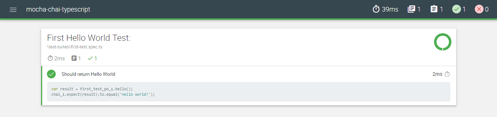

# Mocha, Chai, and Typescript Setup Guide
This is Test Automation framework designed using Mocha, Chai, and Typescript.

## Framework Structure
```
├───images
├───page-objects
├───test-data
├───test-suites
├───.gitignore
├───package.json
├───README.md
└───tslint.json
```

## To Get Started

### Pre-requisites
* Download and install Chrome or Firefox browser.
* Download and install Node.js:
  * [Install Node.JS](https://qaloop.tk/blog/2018/11/23/install-node-js/ "Install Node.JS")
* Optional - Download and install any Text Editor like Visual Code/Sublime/Brackets
  * [Install Visual Studio Code](https://qaloop.tk/blog/2018/11/23/install-visual-studio-code/ "Install Visual Studio Code")


### Setup Scripts 
* Clone the repository into a folder
* Go to Project root directory and install Dependency: `npm install`
* All the dependencies from package.json and ambient typings would be installed in node_modules folder.

### How to write Test
* Add new spec under test-suite folder
* Name the file as <testname>.spec.ts (e.g. super-calculator.spec.ts)
* Create folder under page-objects/pages as <page-name> (e.g. super-calculator)
* Under page folder create constant, helper and page object file.
    * <page-name>.constants.ts (e.g. super-calculator.constants.ts)
    * <page-name>.helper.ts (e.g. super-calculator.helper.ts)
    * <page-name>.po.ts (e.g. super-calculator.po.ts)

### How to Run Test
* Run complete Test Suite: `npm test`

### How to Update local npm packages
* Go to Project root directory and run command: `npm update`

### Sample Test Results
<p align="center">

</p>


## [Step by Step installation instruction for Beginners](https://qaloop.tk/blog/2018/12/26/test-automation-using-mocha-chai-and-typescript/ "Step by Step installation instruction for Beginners")


## Visit my [Blog](https://qaloop.tk/blog/ "Blog")
